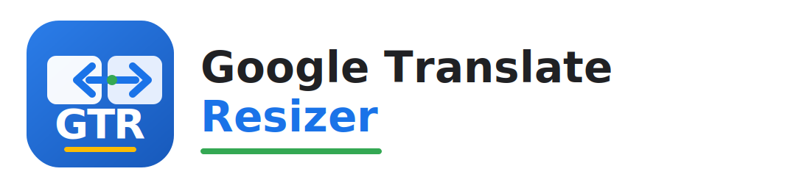

# Google Translate Resizer



English | [繁體中文](#繁體中文)

Google Translate Resizer is a Chrome / Edge extension that resizes the two main text panels on Google Translate.

It can resize both panels together, or resize the source and translation panels separately.

The extension UI supports English and Traditional Chinese. The language follows your browser UI language.

Width changes are applied live while you drag the sliders.

## Download

Download the latest ZIP file from:

[GitHub Releases](https://github.com/FCL2025/Google-Translate-Resizer/releases/latest)

The release asset is named like:

```text
Google-Translate-Resizer-v0.1.6.zip
```

## Install On Chrome

Chrome does not install normal extension ZIP files by dragging them into the Extensions page. Download the ZIP, extract it first, then load the extracted folder.

1. Download `Google-Translate-Resizer-v0.1.6.zip` from the latest release.
2. Extract the ZIP file.
3. Open `chrome://extensions/`.
4. Turn on Developer mode.
5. Click Load unpacked.
6. Select the extracted folder that contains `manifest.json`.
7. Open or refresh Google Translate.
8. Click the extension icon and adjust the panel widths.

## Install On Edge

1. Download `Google-Translate-Resizer-v0.1.6.zip` from the latest release.
2. Extract the ZIP file.
3. Open `edge://extensions/`.
4. Turn on Developer mode.
5. Click Load unpacked.
6. Select the extracted folder that contains `manifest.json`.
7. Open or refresh Google Translate.
8. Click the extension icon and adjust the panel widths.

## Controls

- Sync mode: one slider sets both panel widths.
- Split mode: separate sliders for the left source panel and right translation panel.
- Compact translation preview: reduces extra visual gaps in the result panel without changing the translated text.
- Enable switch: temporarily disables the injected layout rules.
- Reset: restores the default `640 px` widths.

## Brand Assets

- Wordmark SVG: `assets/wordmark.svg`
- Square icon SVG source: `assets/icon.svg`
- Extension PNG icons: `assets/icons/`

## DOM Analysis

The pasted Google Translate component shows the main translation row as:

```html
<div class="OPPzxe">
  <div class="n4sEPd">...</div>
  <c-wiz class="sciAJc">...</c-wiz>
</div>
```

- Left/source panel: `.OPPzxe > .n4sEPd`
- Right/result panel: `.OPPzxe > .sciAJc`
- Shared row wrapper: `.OPPzxe`
- Outer component wrapper: `.ccvoYb`

The content script uses those selectors and applies CSS variables for the current widths. A `MutationObserver` reapplies the settings when Google Translate re-renders the page.

## Install From Source

1. Clone this repository.
2. Open `chrome://extensions/` in Chrome or `edge://extensions/` in Edge.
3. Turn on Developer mode.
4. Click Load unpacked.
5. Select the repository folder.

---

## 繁體中文

[English](#google-translate-resizer) | 繁體中文

Google Translate Resizer 是一個 Chrome / Edge 擴充功能，可以調整 Google 翻譯左右兩側的主要文字區塊寬度。

你可以用同一個拉桿同步調整左右兩側，也可以分別調整左側原文與右側譯文區塊。

擴充功能介面支援英文與繁體中文，會依照瀏覽器 UI 語系自動切換。

拖曳拉桿時會即時套用寬度變更。

## 下載

請到最新版 Release 下載 ZIP：

[GitHub Releases](https://github.com/FCL2025/Google-Translate-Resizer/releases/latest)

Release 內的檔名會類似：

```text
Google-Translate-Resizer-v0.1.6.zip
```

## Chrome 安裝方式

Chrome 不能直接把一般擴充功能 ZIP 拖到擴充功能頁安裝。請先下載 ZIP 並解壓縮，再載入解壓縮後的資料夾。

1. 從最新 Release 下載 `Google-Translate-Resizer-v0.1.6.zip`。
2. 解壓縮 ZIP。
3. 開啟 `chrome://extensions/`。
4. 開啟「開發人員模式」。
5. 點選「載入未封裝項目」。
6. 選擇解壓縮後、包含 `manifest.json` 的資料夾。
7. 開啟或重新整理 Google 翻譯。
8. 點擊擴充功能圖示，使用拉桿調整左右區塊寬度。

## Edge 安裝方式

1. 從最新 Release 下載 `Google-Translate-Resizer-v0.1.6.zip`。
2. 解壓縮 ZIP。
3. 開啟 `edge://extensions/`。
4. 開啟「開發人員模式」。
5. 點選「載入未封裝項目」。
6. 選擇解壓縮後、包含 `manifest.json` 的資料夾。
7. 開啟或重新整理 Google 翻譯。
8. 點擊擴充功能圖示，使用拉桿調整左右區塊寬度。

## 功能控制

- 同步模式：用一個拉桿同時調整左右兩側寬度。
- 分開模式：分別調整左側原文與右側譯文寬度。
- 緊湊譯文預覽：減少右側譯文區塊中額外的視覺空白，不改變實際翻譯文字。
- 啟用開關：暫時停用或啟用注入的版面規則。
- 還原預設：回復到預設 `640 px` 寬度。

## 品牌資產

- Wordmark SVG：`assets/wordmark.svg`
- 方形 icon SVG 原始檔：`assets/icon.svg`
- 擴充功能 PNG icons：`assets/icons/`

## DOM 分析

貼上的 Google Translate 元件顯示主要翻譯列結構為：

```html
<div class="OPPzxe">
  <div class="n4sEPd">...</div>
  <c-wiz class="sciAJc">...</c-wiz>
</div>
```

- 左側原文區塊：`.OPPzxe > .n4sEPd`
- 右側譯文區塊：`.OPPzxe > .sciAJc`
- 共同排版父層：`.OPPzxe`
- 外層元件包裝：`.ccvoYb`

Content script 會使用這些 selector，透過 CSS 變數套用目前寬度。Google 翻譯重新渲染頁面時，`MutationObserver` 會重新套用設定。

## 從原始碼安裝

1. Clone 這個 repository。
2. 在 Chrome 開啟 `chrome://extensions/`，或在 Edge 開啟 `edge://extensions/`。
3. 開啟「開發人員模式」。
4. 點選「載入未封裝項目」。
5. 選擇此 repository 資料夾。
